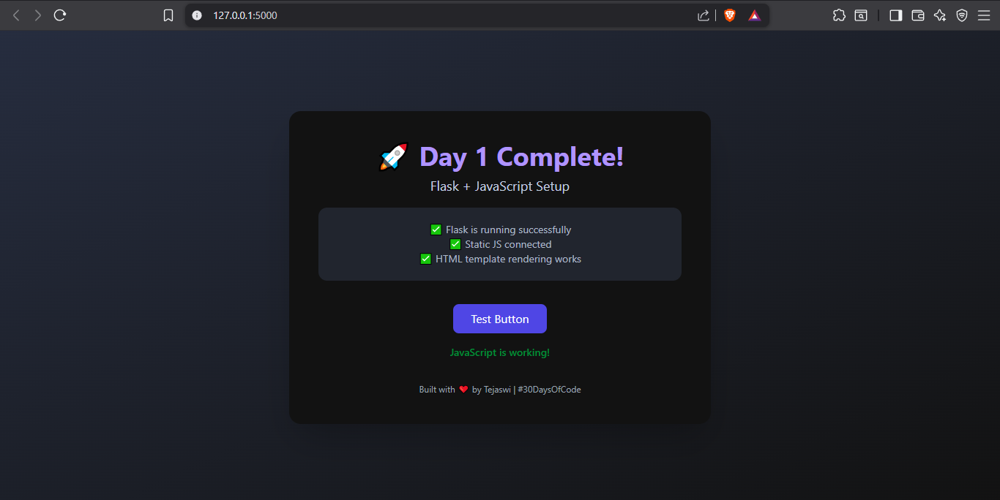
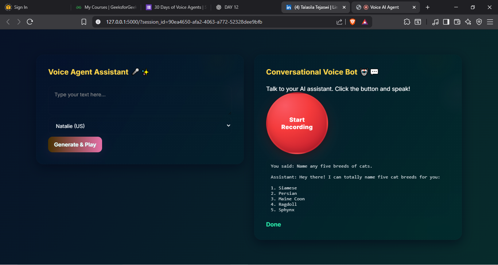
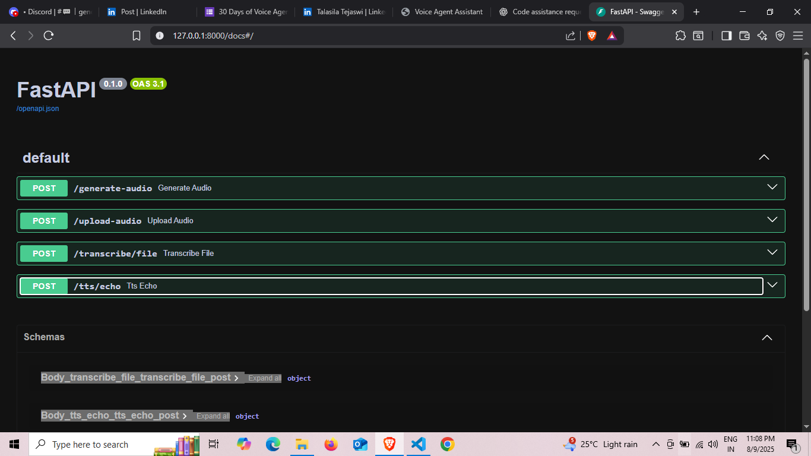
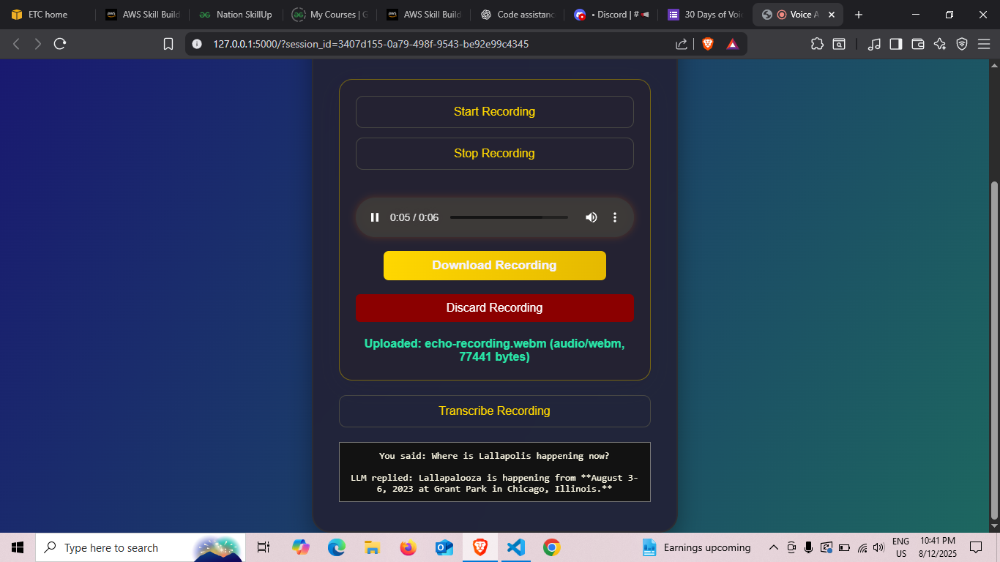

# 🎙️ AI Voice Agent — Conversational Intelligence in Real Time

> Part of my **#30DaysOfVoiceAgents** challenge — building an end-to-end AI-powered voice assistant that feels natural, responsive, and production-ready.

---

## 🚀 Overview

This project is a **dual-mode Voice AI application**:
- **Voice Agent Assistant (Text-to-Speech)** — Type anything, choose a voice, and hear it instantly.
- **Conversational Voice Bot (LLM + TTS)** — Speak naturally, let the AI transcribe, think, and respond in a lifelike voice.

It’s designed with **speed, clarity, and engagement** in mind — from the **glassmorphic UI** to the **seamless speech pipeline**.

---

## ✨ Features

- 🎤 **Single Smart Record Button** — Start/Stop recording with one tap, animated for intuitive feedback.
- ⏱ **Live Recording Timer** — Shows how long you’ve been speaking.
- 🔊 **Auto-Playback** — AI responses play instantly without clicking.
- 🧠 **Full AI Pipeline**:
  1. Voice input (Browser Recording API)
  2. **AssemblyAI** — Real-time transcription
  3. **Google Gemini** — Conversational reasoning
  4. **Murf AI** — Human-like voice generation
- 🎨 **Million-Dollar UI** — Glassmorphism, smooth animations, responsive design.

---

## 🛠️ Tech Stack

**Frontend**
- HTML5, CSS3, JavaScript (Vanilla)
- CSS animations & glassmorphism design
- Audio Recording API

**Backend**
- **Flask** (`app01.py`) — Handles TTS generation
- **FastAPI** (`main.py`) — Handles full voice pipeline & file uploads
- **AssemblyAI** — Speech-to-text
- **Google Gemini** — LLM text generation
- **Murf AI** — Text-to-speech

**Other**
- `python-dotenv` for environment configuration
- `requests` for API calls
- `ffmpeg` for audio format handling (optional but recommended)

---

## 🏗️ Architecture

[ Browser UI ]
| (audio/text)
v
[ Flask (TTS) ] ----> Murf AI API
[ FastAPI (LLM+Voice) ] ---> AssemblyAI ---> Gemini LLM ---> Murf AI

Both services can run in parallel, and the UI shows **both assistants side-by-side**.

---

## 📦 Installation

1. **Clone the repo**  
git clone https://github.com/yourusername/voice-ai-agent.git  
cd voice-ai-agent

2. **Install dependencies**  
pip install -r requirements.txt

3. **Set environment variables**  
Create a `.env` file in the project root:

MURF_API_KEY=your_murf_api_key  
ASSEMBLYAI_API_KEY=your_assemblyai_key  
GEMINI_API_KEY=your_gemini_key

4. **(Optional) Ensure ffmpeg is installed**  
ffmpeg -version

---

## ▶️ Running the App

**Start Flask server (TTS Assistant)**  
python app01.py

**Start FastAPI server (LLM + Voice Bot)**  
uvicorn main:app --reload --port 8000

Open `index.html` in your browser (served via Flask static files).

---

## 🔗 API Endpoints

### POST /generate-audio  
Generate Murf TTS from given text.  

**Body (JSON):**  
{
  "text": "Hello world",
  "voiceId": "en-US-natalie",
  "format": "mp3"
}

---

### POST /upload-audio  
Upload recorded audio file.  

**Form-data:**  
- audio: audio file

---

### POST /agent/chat/{session_id}  
Complete voice pipeline:  
1. Audio → AssemblyAI (transcription)  
2. Text → Gemini (response)  
3. Response → Murf AI (voice)  

**Returns:** transcription, LLM text, and audio file URL.

---

## Screenshots

### Voice Generator UI

### Voice Agent LLM

### FastAPI Backend

### TTS Recording

---

## 💡 My Flair — Why This Project Stands Out

- Designed for **real product feel**, not just a tutorial.  
- Instant feedback loop — no waiting, no manual steps.  
- **Modular architecture** — can swap out AI providers easily.  
- UI that **invites interaction** — this isn’t your average dev console app.

---

## 🏆 Credits

Built with ❤️ during #30DaysOfVoiceAgents using:  
- [AssemblyAI](https://www.assemblyai.com/)  
- [Google Gemini](https://deepmind.google/)  
- [Murf AI](https://murf.ai/)
